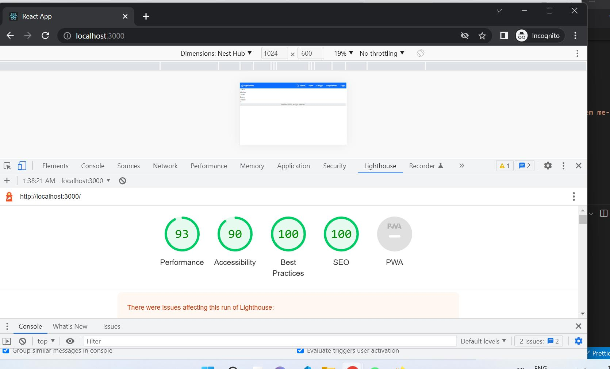
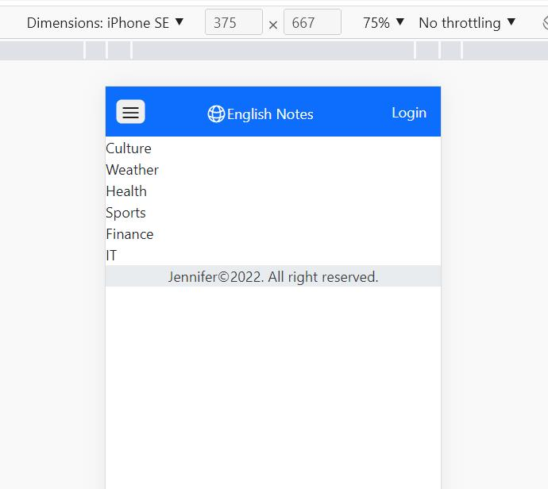

# English Notes

## Objective

- Create a high performance React App
- Comply with WCAG2.1. Level AA
- Imporve english vocabulary day by day

## Framework and 3rd libraries

- React
- Typescript
- Bootstrap 5
- Markdown Editor : @uiw/react-md-editor
- React-router-dom v6
- Protected routes
- Markdown Display: Markdown to JSX
- Yup, React-hook-form
- database: Firestore database (attention: ≠ Realtime database)
- authentication: email-password
- tsconfig.json: absolute imports
- Modify webpack.config.js without eject using @craco/craco
- analyzer and compress bundled files after building

## Vscode extensions

- intellisense for css class names in HTML
- html css support
- emmet
- auto import
- auto rename tag
- react/redux/react-native snippets

## Configurations

- create .env.local under root folder(package.json exists)

```
REACT_APP_API_KEY=your-api-key
REACT_APP_AUTH_DOMAIN=your-app-auth-domain
...
```

- set environment variables under window powershell

```
$env:variable='value'
```

- npm run start

## Screenshots




# create and edit blog

https://www.youtube.com/watch?v=0pPlbLyeclI

current Markdown
https://npm.io/package/@uiw/react-md-editor
